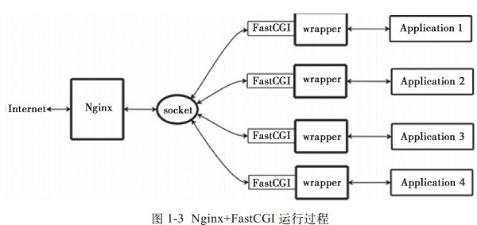

# Nginx原理

Nginx分为单工作进程和多工作进程两种工作模式。
- 单工作进程则是除了master进程外，worker是单线程的 (默认为此模式)
- 多工作进程则是除了master进程外，worker都是多线程的

## Master进程
master进程主要是用来管理worker进程的，大致包括：
- 接受外界信号 (start、reload、stop等)
- 向worker发送信号 (start、stop等信号)
- 监控worker的状态，当worker进程退出后，master重新启动一个新的worker进程

master相当于用户与进程组之间的一个桥梁，它不处理网络事件，只负责传递信号以及监控worker进程，通过管理worker进程来实现重启服务，记录日志，
配置读取等功能。

## Worker进程
worker进程处理基本的网络事件，worker进程之间是相互独立并且相互竞争的。一个请求只会在一个worker中处理，一个worker不可能处理其他进程的请求。
worker进程数一般设置为CPU的数量

## 工作流程
启动Nginx后，master进程开启，通过socket创建一个sock文件描述符来监听进程，然后fork出worker进程，所有的worker进程继承了master的sock
文件描述符，因为都是继承至父级进程，当有请求过来后，所有worker在接受连接前先获取锁，如果获取不到则放弃执行accept()，获取到这个锁(排它锁)
后开始读取请求，解析请求，处理请求，然后返回给客户端。

> worker中的锁（accept_mutex）主要是解决惊群现象，如果没有这个锁，则所有worker会被激活并挂起，消耗大量的系统资源。获取锁的操作是实时返回
不会阻塞，争抢accept则会造成阻塞。


## FastCGI
全称为Fast Common Gateway Interface(快速的网关通用接口)，是由CGI进化而来。
- CGI性能差，因为每次有动态程序的时候就要重新启动脚本解析器，解析后返回给服务器，且安全性差。（fork一个新的进程进行处理，读取参数，处理数据，然后就结束生命期）
- FastCGI则是在服务器上启动多个脚本解析器，当服务器需要解析动态程序时，可以直接交付给FastCGI进程处理，然后返回给服务器。（要开启tcp端口，进入循环，等待数据的到来，处理数据）



## PHP-FPM
全程为PHP FastCGI Process Manager(PHP的FastCGI进程管理器)。因为Nginx只是一个Http的服务器，不具备解析动态程序的能力，所以需要第三方
模块实现FastCGI后才能进行解析，而PHP-FPM则是用来解析PHP的Nginx模块。所以在配置Nginx支持PHP中都需要加入:
```nginx
location ~ \.php$ {
    root html;   
    fastcgi_pass 127.0.0.1:9000; # 指定了fastcgi进程侦听的端口,nginx就是通过这里与php交互的
    fastcgi_index index.php;
    include fastcgi_params; # 引入了一些fastcgi的常量
    fastcgi_param SCRIPT_FILENAME   /usr/local/nginx/html$fastcgi_script_name;
}
```
大致工作流:
```
 www.example.com
        |
        |
      Nginx
        |
        |
路由到www.example.com/index.php
        |
        |
加载nginx的fast-cgi模块
        |
        |
fast-cgi监听127.0.0.1:9000地址
        |
        |
www.example.com/index.php请求到达127.0.0.1:9000
        |
        |
     等待处理...
```
1. 用户敲网址前，master启动，fork出worker进程
2. 用户输入网址后，经过nginx
3. nginx路由到index.php文件
4. 发现是动态程序，则加载fast-cgi模块
5. 根据配置，启动php-cgi并创建php-fpm进程维护php-cgi，监听127.0.0.1:9000地址
6. 请求根据配置转发到127.0.0.1:9000
7. 处理后返回给Nginx